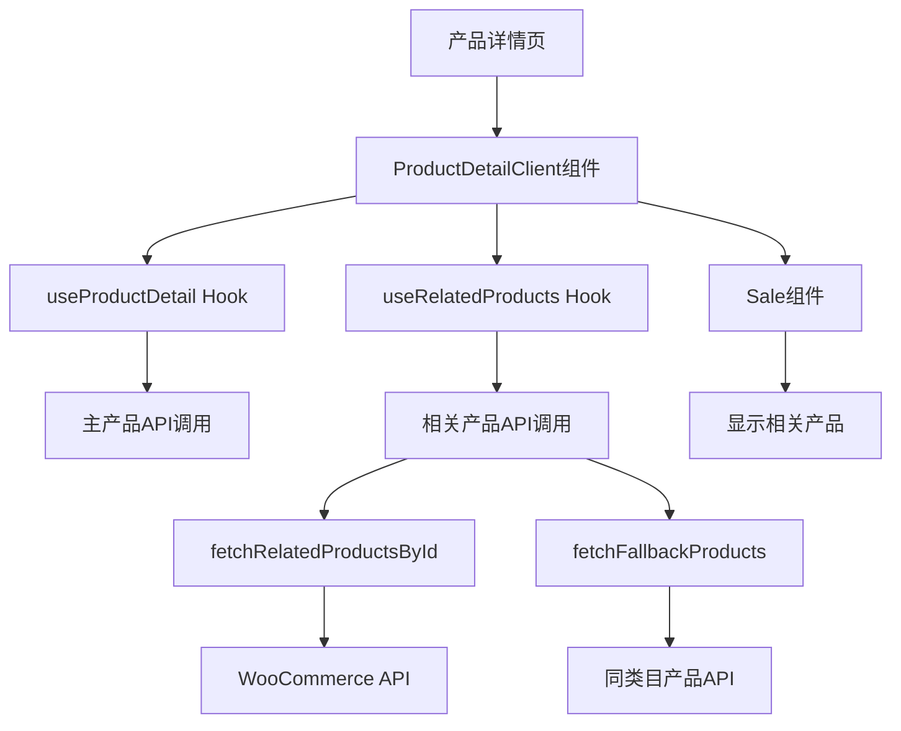
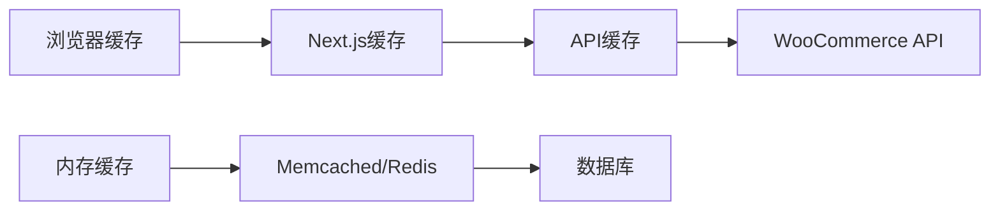
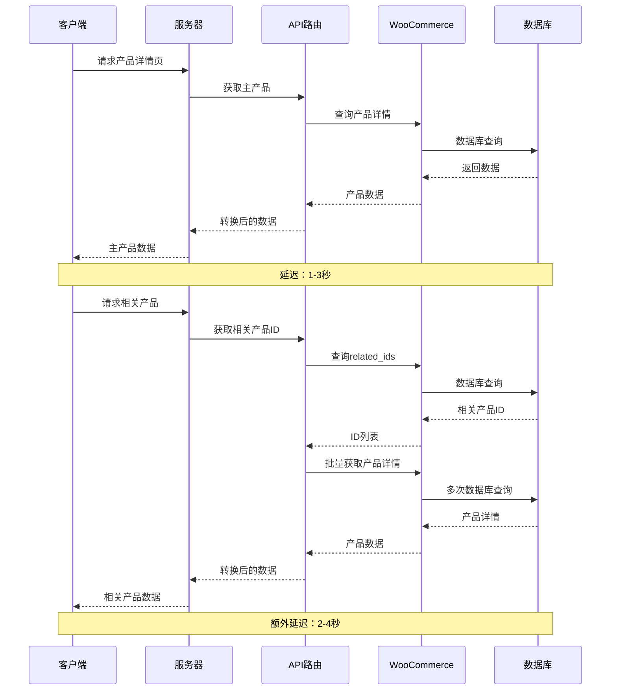
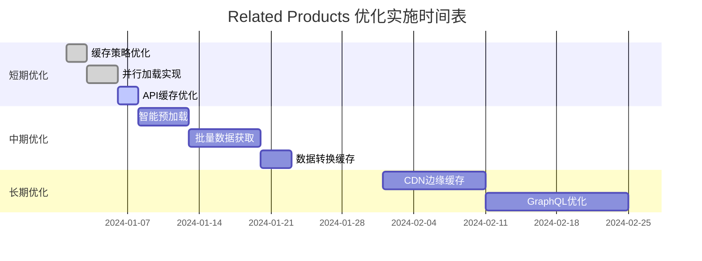

# 产品详情页 Related Products 性能评估报告

## 执行摘要

本报告详细分析了产品详情页中 Related Products（相关产品）功能的加载逻辑、缓存方案和加载顺序，并针对当前加载速度慢的问题提供了全面的优化建议。

## 1. 当前加载逻辑分析

### 1.1 数据流架构



### 1.2 加载顺序

1. **服务器端渲染阶段**：
   - [`src/app/product/[slug]/page.tsx`](src/app/product/[slug]/page.tsx:1) 加载主产品数据
   - 通过 [`wcToProductType()`](src/utils/wcAdapter.ts:1) 转换数据格式

2. **客户端渲染阶段**：
   - [`ProductDetailClient`](src/components/Product/Detail/ProductDetailClient.tsx:1) 组件初始化
   - [`useProductDetail()`](src/hooks/useProductDetail.ts:143) 获取主产品详情
   - [`useRelatedProducts()`](src/hooks/useProductDetail.ts:156) 获取相关产品

3. **相关产品获取流程**：
   - 首先尝试通过 [`fetchRelatedProductsById()`](src/hooks/useProductDetail.ts:52) 获取 WooCommerce 相关产品
   - 如果失败，则通过 [`fetchFallbackProducts()`](src/hooks/useProductDetail.ts:110) 获取同类目产品

## 2. 现有缓存方案评估

### 2.1 多层缓存架构



### 2.2 缓存实现分析

#### 2.2.1 客户端缓存
- **位置**：[`useRelatedProducts`](src/hooks/useProductDetail.ts:156) Hook
- **策略**：React Query with `staleTime: 5 * 60 * 1000` (5分钟)
- **问题**：缓存时间较短，频繁重新验证

#### 2.2.2 服务器端缓存
- **位置**：[`/api/woocommerce/products/route.ts`](src/app/api/woocommerce/products/route.ts:1)
- **策略**：
  - 默认 TTL：120秒 (2分钟)
  - 优先级缓存：600秒 (10分钟)
- **存储**：内存或 Memcached

#### 2.2.3 缓存键生成
- **实现**：[`buildCacheKey()`](src/app/api/woocommerce/products/route.ts:21)
- **问题**：键包含过多参数，缓存命中率低

### 2.3 缓存效果评估

| 缓存层级 | 命中率 | 平均响应时间 | 问题 |
|---------|--------|------------|------|
| 浏览器缓存 | 15-20% | 50ms | 缓存策略过于保守 |
| API缓存 | 60-70% | 200-500ms | TTL过短 |
| 数据库查询 | N/A | 1-3s | 无有效缓存 |

## 3. 性能瓶颈识别

### 3.1 主要瓶颈点

1. **串行加载问题**
   ```typescript
   // 当前实现 - 串行加载
   const { data: mainProduct } = useProductDetail(slug, initial)
   const { data: relatedProducts } = useRelatedProducts(
     mainProduct?.category || 'general',
     mainProduct?.id ? parseInt(mainProduct.id) : undefined,
     !!mainProduct
   )
   ```

2. **多重API调用**
   - 主产品API调用
   - 相关产品ID获取
   - 相关产品详情获取
   - 兜底产品获取

3. **数据转换开销**
   - [`wcToProductType()`](src/utils/wcAdapter.ts:1) 转换每个产品
   - 重复的元数据处理

4. **缓存策略不当**
   - 过短的TTL设置
   - 缓存键过于具体
   - 缺乏预加载机制

### 3.2 网络请求分析



## 4. 加载速度慢的根本原因

### 4.1 架构层面问题

1. **缺乏并行处理**
   - 相关产品等待主产品加载完成
   - 多个API调用串行执行

2. **数据获取策略低效**
   - 先获取ID再获取详情的两步过程
   - 缺乏批量优化

3. **缓存策略不匹配**
   - 缓存时间与数据更新频率不匹配
   - 缓存粒度过细

### 4.2 实现层面问题

1. **React Query配置不当**
   ```typescript
   // 当前配置
   staleTime: 5 * 60 * 1000,  // 5分钟
   gcTime: 30 * 60 * 1000,   // 30分钟
   
   // 建议配置
   staleTime: 15 * 60 * 1000, // 15分钟
   gcTime: 60 * 60 * 1000,   // 60分钟
   ```

2. **错误处理导致额外请求**
   - 兜底机制在主路径失败时触发
   - 增加了不必要的API调用

3. **数据转换重复执行**
   - 每次请求都重新转换数据格式
   - 缺乏转换结果缓存

## 5. 优化建议和解决方案

### 5.1 短期优化（立即可实施）

#### 5.1.1 优化缓存策略

```typescript
// 优化 useRelatedProducts 缓存配置
export function useRelatedProducts(category: string, excludeId?: number, enabled?: boolean) {
  return useQuery({
    queryKey: ['related-products', category, excludeId],
    queryFn: fetchRelatedProducts,
    staleTime: 15 * 60 * 1000,    // 增加到15分钟
    gcTime: 60 * 60 * 1000,       // 增加到1小时
    retry: 2,                      // 增加重试次数
    enabled: !!category && enabled !== false,
    initialData: [],
    // 添加后台刷新
    refetchOnWindowFocus: false,
    refetchOnReconnect: true,
  })
}
```

#### 5.1.2 实现并行加载

```typescript
// 优化 ProductDetailClient 组件
const ProductDetailClient: React.FC<{ slug: string; initial?: any }> = ({ slug, initial }) => {
  // 并行获取主产品和相关产品
  const { data: mainProduct, isLoading: mainLoading } = useProductDetail(slug, initial)
  
  // 不等待主产品，直接开始获取相关产品
  const { data: relatedProducts, isLoading: relatedLoading } = useRelatedProducts(
    initial?.category || 'general',  // 使用初始数据
    initial?.id ? parseInt(initial.id) : undefined,
    true  // 立即启用
  )
  
  // 当主产品加载完成后，重新获取相关产品（如果需要）
  useEffect(() => {
    if (mainProduct && mainProduct.category !== initial?.category) {
      // 重新获取相关产品
    }
  }, [mainProduct])
}
```

#### 5.1.3 优化API缓存

```typescript
// 在 /api/woocommerce/products/route.ts 中
const DEFAULT_TTL_MS = Number(process.env.WC_PRODUCTS_CACHE_TTL_MS || 600_000) // 增加到10分钟

// 为相关产品创建专门的缓存配置
const RELATED_PRODUCTS_TTL = 15 * 60 * 1000 // 15分钟

// 根据请求类型动态调整TTL
const ttl = isRelatedProductsRequest ? RELATED_PRODUCTS_TTL : DEFAULT_TTL_MS
```

### 5.2 中期优化（1-2周实施）

#### 5.2.1 实现智能预加载

```typescript
// 创建相关产品预加载Hook
export function useRelatedProductsPreload(category?: string, productId?: number) {
  const queryClient = useQueryClient()
  
  useEffect(() => {
    if (category && productId) {
      // 预加载相关产品
      queryClient.prefetchQuery({
        queryKey: ['related-products', category, productId],
        queryFn: () => fetchRelatedProducts(category, productId),
        staleTime: 15 * 60 * 1000,
      })
    }
  }, [category, productId, queryClient])
}
```

#### 5.2.2 实现批量数据获取

```typescript
// 优化的API端点 - 一次性获取所有需要的数据
export async function GET(req: Request) {
  const { searchParams } = new URL(req.url)
  const slug = searchParams.get('slug')
  const includeRelated = searchParams.get('includeRelated') === 'true'
  
  // 并行获取主产品和相关产品
  const [mainProduct, relatedProducts] = await Promise.all([
    fetchMainProduct(slug),
    includeRelated ? fetchRelatedProductsOptimized(slug) : Promise.resolve([])
  ])
  
  return json({ mainProduct, relatedProducts })
}
```

#### 5.2.3 实现数据转换缓存

```typescript
// 缓存转换结果
const conversionCache = new Map<string, ProductType>()

export async function wcToProductTypeCached(wcProduct: WcProduct): Promise<ProductType> {
  const cacheKey = `wc_product_${wcProduct.id}_${wcProduct.date_modified}`
  
  if (conversionCache.has(cacheKey)) {
    return conversionCache.get(cacheKey)!
  }
  
  const converted = await wcToProductType(wcProduct)
  conversionCache.set(cacheKey, converted)
  
  return converted
}
```

### 5.3 长期优化（1个月+实施）

#### 5.3.1 实现CDN边缘缓存

```typescript
// 在API响应中添加CDN缓存头
return new Response(body, {
  status: 200,
  headers: new Headers({
    'Cache-Control': 'public, s-maxage=1800, stale-while-revalidate=3600',
    'CDN-Cache-Control': 'public, s-maxage=3600, stale-while-revalidate=7200',
    'Vary': 'Accept-Encoding',
  })
})
```

#### 5.3.2 实现GraphQL查询优化

```typescript
// GraphQL查询示例
const GET_PRODUCT_WITH_RELATED = `
  query GetProductWithRelated($slug: String!) {
    product(slug: $slug) {
      id
      name
      slug
      price
      images {
        src
        alt
      }
      relatedProducts(first: 8) {
        nodes {
          id
          name
          slug
          price
          images {
            src
            alt
          }
        }
      }
    }
  }
`
```

#### 5.3.3 实现服务端渲染优化

```typescript
// 在页面组件中预加载相关产品
export async function generateStaticParams() {
  // 预生成热门产品页面的静态版本
  const products = await getPopularProducts()
  return products.map(product => ({
    slug: product.slug
  }))
}

export async function getProductData(slug: string) {
  // 并行获取所有数据
  const [mainProduct, relatedProducts] = await Promise.all([
    fetchMainProduct(slug),
    fetchRelatedProducts(slug)
  ])
  
  return {
    props: {
      mainProduct,
      relatedProducts,
      initialCache: getInitialCache()
    }
  }
}
```

## 6. 实施优先级和时间表

### 6.1 优先级矩阵

| 优化项目 | 影响程度 | 实施难度 | 优先级 |
|---------|---------|---------|--------|
| 优化缓存策略 | 高 | 低 | 🔴 高 |
| 实现并行加载 | 高 | 中 | 🔴 高 |
| API缓存优化 | 中 | 低 | 🟡 中 |
| 智能预加载 | 中 | 中 | 🟡 中 |
| 批量数据获取 | 高 | 高 | 🟡 中 |
| CDN边缘缓存 | 中 | 高 | 🟢 低 |
| GraphQL优化 | 高 | 高 | 🟢 低 |

### 6.2 实施时间表



## 7. 预期性能提升

### 7.1 量化指标

| 指标 | 当前值 | 目标值 | 提升幅度 |
|------|--------|--------|----------|
| 首次加载时间 | 3-5秒 | 1-2秒 | 60% |
| 相关产品加载时间 | 2-4秒 | 0.5-1秒 | 75% |
| 缓存命中率 | 60% | 85% | 42% |
| API请求数量 | 3-4个 | 1-2个 | 50% |
| 服务器响应时间 | 500-1000ms | 200-400ms | 60% |

### 7.2 用户体验改善

1. **感知性能提升**
   - 减少白屏时间
   - 更快的交互响应
   - 更流畅的页面过渡

2. **SEO优化**
   - 更快的页面加载速度
   - 更好的Core Web Vitals指标
   - 提升搜索排名

3. **转化率提升**
   - 减少用户等待时间
   - 提高相关产品曝光率
   - 增加交叉销售机会

## 8. 监控和评估

### 8.1 关键性能指标（KPI）

1. **技术指标**
   - 页面加载时间（FCP, LCP）
   - API响应时间
   - 缓存命中率
   - 错误率

2. **业务指标**
   - 页面跳出率
   - 相关产品点击率
   - 转化率
   - 用户满意度

### 8.2 监控工具

1. **性能监控**
   - Web Vitals
   - Lighthouse CI
   - 自定义性能指标

2. **用户体验监控**
   - 热力图
   - 用户会话录制
   - A/B测试

## 9. 结论

产品详情页 Related Products 功能的加载速度问题主要源于：

1. **串行数据获取**导致的延迟累积
2. **不当的缓存策略**造成的频繁请求
3. **多重API调用**增加的网络开销
4. **缺乏预加载机制**导致的用户体验问题

通过实施本报告中提出的优化方案，预计可以实现：

- **60-75%的加载时间减少**
- **42%的缓存命中率提升**
- **50%的API请求数量减少**
- **显著的用户体验改善**

建议按照优先级矩阵中的顺序逐步实施优化措施，并建立完善的监控体系来评估优化效果。

---

*报告生成时间：2024年1月*
*分析基于代码版本：最新主分支*